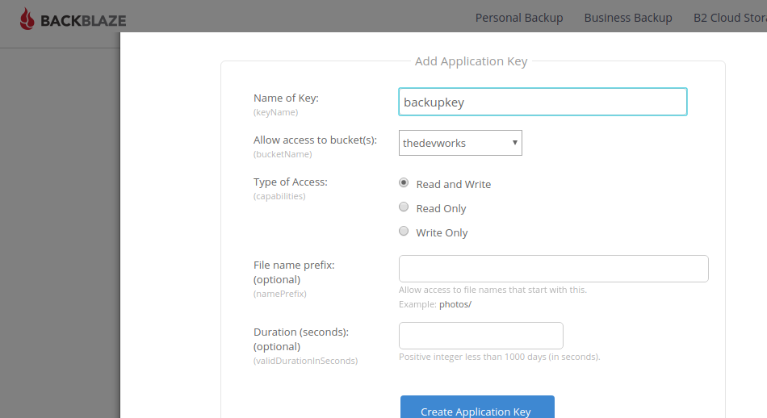

# Database Backups

Since we have a database sat there on a single server, and the data is constantly changing as users sign up and save data, we need to take backups of the database, so in the event of a server failure \(These happen even to the best hosting companies, just recently Digital Ocean lost one of my servers!\) we can recover all the data. 

The question is, how much data are you willing to lose? Well, since our database is quite small, and the overhead of backing it up is marginal, we may as well take very regular backups throughout the day. First lest start by creating a script, that will 'dump' our database locally every time we run it. 

```text
#!/bin/bash
 

BACKUPS_DIR="/home/username/backups/$APP_NAME"
mkdir -p $BACKUPS_DIR

MONGO_DATABASE="parse"
APP_NAME="parse"

MONGO_HOST="127.0.0.1"
MONGO_PORT="27017"
TIMESTAMP=`date +%F-%H%M`
MONGODUMP_PATH="/usr/bin/mongodump"
BACKUP_NAME="$APP_NAME-$TIMESTAMP"
 
ARCHIVE_PATH="$BACKUPS_DIR/$BACKUP_NAME.gz"
$MONGODUMP_PATH --db $MONGO_DATABASE --archive=$ARCHIVE_PATH --gzip
 
```

Then we make it executable, and add it to a cron job. Ill set mine to run every 10 minutes. 

```text
chmod +x mongo_backup.sh
crontab -e
*/10 * * * * /bin/bash /home/username/envronment/mongobackup.sh
```

So this backs up to your /backups folder in your home folder. Now, thats great in terms of data corruption, but lets ship these backups offsite. For this example I'll use BackBlaze, however the process is similar with most online storage. 

First lets setup a new key on the b2 service; 



Now we can install the b2 service, and add a command to our backup script

```text
pip3 install b2
b2 authorize-account <applicationKeyId> <ApplicationKey>
b2 sync --keepDays 10  /home/thedevworks/backups b2://thedevworks
```

We can now add the latter command to the end of our backup

```text
b2 sync --keepDays 10  /home/thedevworks/backups b2://thedevworks
```

The last thing we need to do, is clean up our backups so they don't grow too large! Let's add this to the end of our script. 

```text
find /home/thedevworks/backups/* -mtime +10 -exec rm {} \;
```

Ok all done! So to summarize, we; 

* Created a backup script to backup our MongoDb database to a local folder
* Automated the script using crontab to run every 10 minutes
* Added code to upload our backups to an online backup service
* Cleared our local backups that are older than 10 days

